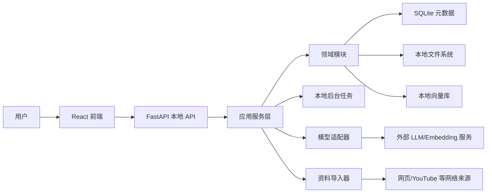
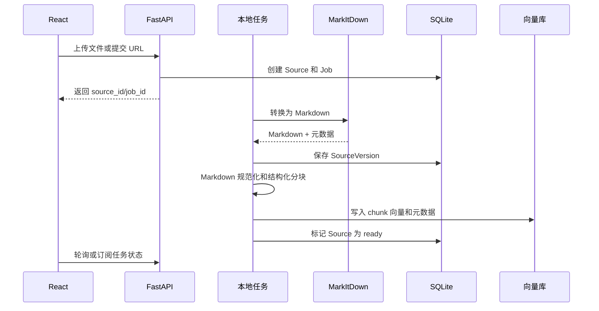
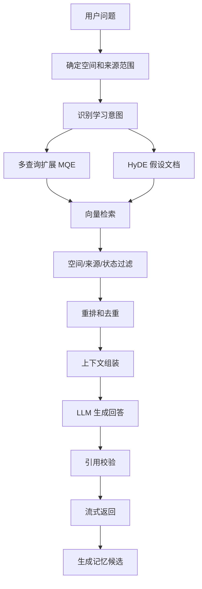
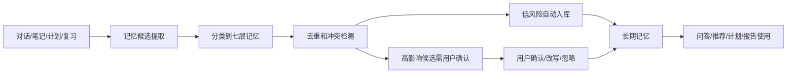

# LearnFast 项目架构文档

文档版本：v0.1
创建日期：2026-07-08
技术栈：React + Python
适用阶段：第一阶段 MVP 技术方案、工程拆分、实现对齐
关联文档：[PRD-LearnFast.md](./PRD-LearnFast.md)、[MVP-Phase1-LearnFast.md](./MVP-Phase1-LearnFast.md)

## 1. 架构结论

LearnFast 第一阶段采用本地优先、单用户、模块化单体架构。

核心形态：

- 前端：React + TypeScript + Vite，运行在浏览器或后续桌面壳内。
- 后端：Python + FastAPI，本地启动 HTTP API 和流式问答接口。
- 数据：SQLite 保存结构化业务数据，文件系统保存原始文件和 Markdown 产物，嵌入式向量库存知识块向量。
- AI：用户自带模型密钥，通过统一模型适配器调用 LLM、Embedding、视觉、语音等能力。
- RAG：资料进入统一 Markdown 管线，经过结构化分块、向量化、MQE、HyDE 和引用约束后参与问答。
- 记忆：每个学习空间独立维护记忆候选、长期记忆、能力状态和计划进度，不跨空间默认共享。

第一阶段不引入云端账号、多租户、远程同步、多人协作、分布式任务队列或微服务。

## 2. 已确认产品与技术决策

| 决策项 | 结论 | 架构影响 |
| --- | --- | --- |
| 用户形态 | MVP 先做本地/单用户版本 | 不做登录、组织、租户、云端鉴权 |
| 模型调用 | 允许用户自带模型密钥 | 本地密钥管理、统一模型适配器、调用前展示数据发送范围 |
| 限制策略 | MVP 文件大小、资料数量、空间数量先由代码硬编码 | 以常量集中管理，后续再产品化配置 |
| 知识复查 | 先以复习问答和计划任务承载 | 不做独立闪卡系统 |
| 学习报告 | 用户手动生成 | 不做定时任务和通知系统 |
| 扩展资料 | 支持网页链接、YouTube、EPub、CSV、Excel | 资料接入层需要统一 URL/文件导入抽象 |
| 一级入口 | “资料”和“记忆”作为显性一级入口 | 空间内导航固定包含学习、资料、笔记、计划、记忆、报告 |
| 存储策略 | 本地优先 | 默认数据落本机，外部调用仅限模型请求和网络资料拉取 |
| 技术栈 | React + Python | 前后端分离，Python 承担资料处理和 AI 编排 |

## 3. 架构目标

- 本地优先：用户资料、笔记、计划、记忆和索引默认保存在本机。
- 资料可信：AI 回答可回溯到资料、笔记、记忆或计划上下文。
- 空间隔离：学习空间是数据隔离边界，所有查询、记忆、计划默认按空间过滤。
- 可扩展导入：新增资料类型时只扩展导入器和转换器，不改问答主流程。
- 可替换模型：LLM、Embedding、视觉、转写等能力通过适配器切换。
- 渐进复杂度：第一阶段用单进程后台任务，后续再替换为独立 worker 或任务队列。
- 可测试：资料处理、分块、检索、引用、记忆提取都要能用固定样例回归。

## 4. 技术栈选型

### 4.1 前端

| 能力 | 选型 | 用途 |
| --- | --- | --- |
| UI 框架 | React + TypeScript | 构建学习空间、问答、资料、笔记、计划、记忆等页面 |
| 构建工具 | Vite | 本地开发、打包、静态资源构建 |
| 路由 | React Router | 空间列表、空间详情、多页面导航 |
| Server State | TanStack Query | API 请求、缓存、重试、失效刷新 |
| Client State | Zustand 或 React Context | 当前空间、布局、临时 UI 状态 |
| 样式 | Tailwind CSS + 轻量组件封装 | 快速构建克制、密集、可读的学习工具界面 |
| Markdown 编辑 | CodeMirror 6 或 Monaco | 笔记编辑、Markdown 预览、资料 Markdown 查看 |
| 流式响应 | Fetch Streaming 或 SSE 客户端 | 问答流式输出 |

前端原则：

- 以空间内工作台为主界面，不做营销首页。
- 一级导航固定为：学习、资料、笔记、计划、记忆、报告。
- 所有 AI 生成内容展示来源标签：资料、笔记、记忆、模型推理、用户编辑。
- 长文、引用、Markdown 预览优先保证可读性。

### 4.2 后端

| 能力 | 选型 | 用途 |
| --- | --- | --- |
| API 框架 | FastAPI | 本地 HTTP API、OpenAPI 文档、流式问答 |
| 数据校验 | Pydantic | 请求、响应、配置、AI 结构化输出校验 |
| ORM | SQLAlchemy | SQLite 业务表访问 |
| 迁移 | Alembic | 本地数据库 schema 迁移 |
| 结构化存储 | SQLite | 学习空间、资料、笔记、计划、记忆、任务、日志 |
| 文件存储 | 本地文件系统 | 原始文件、Markdown、导出文件、处理中间产物 |
| 向量存储 | LanceDB | 本地嵌入式向量索引和元数据过滤 |
| 资料转换 | MarkItDown | PDF、Office、图片、音频、HTML、CSV、YouTube、EPub 等转 Markdown |
| 模型适配 | LiteLLM 风格统一接口 + 自研能力注册 | 多厂商 LLM、Embedding、视觉、转写调用 |
| 后台任务 | 进程内任务队列 | 文件转换、分块、向量化、报告生成 |

第一阶段建议优先实现自研薄封装，避免过早引入复杂 Agent 框架。RAG、记忆、计划和报告作为应用服务显式编排，方便测试和调试。

### 4.3 存储选择

默认存储位置：

- 开发环境：`./.learnfast-data/`
- 桌面打包后：操作系统用户数据目录下的 `LearnFast/`

目录建议：

```text
.learnfast-data/
  learnfast.sqlite
  raw/
    {space_id}/{source_id}/original
  markdown/
    {space_id}/{source_id}/{version_id}.md
  artifacts/
    {space_id}/{source_id}/
  indexes/
    lancedb/
  exports/
    {space_id}/
  logs/
```

存储职责：

- SQLite：存关系、状态、权限边界、引用关系、任务记录。
- 文件系统：存大文件、转换产物、导出产物。
- 向量库：存 chunk 向量、chunk 文本、chunk 元数据、空间过滤字段。

## 5. 总体架构



架构边界：

- React 不直接访问本地数据库和文件系统，只访问本地 API。
- FastAPI 是本地唯一后端入口，负责安全检查、空间过滤、任务编排。
- 资料导入、转换、索引、问答、记忆提取都必须带 `space_id`。
- 外部网络访问只发生在用户明确导入 URL/YouTube 或调用外部模型时。

## 6. 后端分层

```text
apps/api/learnfast/
  main.py
  core/
    config.py
    limits.py
    errors.py
    security.py
  api/
    routes/
    deps.py
    schemas/
  application/
    spaces_service.py
    source_ingestion_service.py
    retrieval_service.py
    qa_service.py
    note_service.py
    memory_service.py
    plan_service.py
    report_service.py
    model_service.py
  domain/
    models/
    policies/
    events/
  infrastructure/
    db/
    file_store/
    vector_store/
    converters/
    model_clients/
    importers/
    jobs/
  tests/
```

分层职责：

- API 层：接收请求、鉴权占位、参数校验、返回响应、流式传输。
- Application 层：编排业务流程，如上传资料、处理资料、问答、保存笔记。
- Domain 层：定义核心对象、状态机、策略和不变量。
- Infrastructure 层：数据库、文件、向量库、MarkItDown、模型、网络导入等适配。
- Jobs 层：执行长耗时任务，记录进度和失败原因。

禁止事项：

- API route 中直接拼 RAG prompt。
- 前端传入未校验的文件路径让后端读取。
- 检索、记忆、计划跨空间访问不经过空间策略。
- 将用户 API Key 明文写入日志、SQLite 或前端缓存。

## 7. 前端模块

```text
apps/web/src/
  app/
    router.tsx
    providers.tsx
  pages/
    SpacesPage/
    WorkspacePage/
    SettingsPage/
  features/
    spaces/
    learning/
    sources/
    notes/
    plans/
    memories/
    reports/
    model-settings/
    search/
  components/
    layout/
    markdown/
    citations/
    status/
    forms/
  lib/
    api-client.ts
    stream.ts
    query-keys.ts
    limits.ts
```

主要页面：

- `SpacesPage`：学习空间列表、新建、归档、删除。
- `WorkspacePage`：空间内布局，固定一级入口。
- `Learning`：问答、上下文来源、保存为笔记、加入计划。
- `Sources`：资料上传、URL 导入、处理状态、Markdown 预览、引用定位。
- `Notes`：Markdown 编辑、碎片笔记、标签、关联来源。
- `Plans`：AI 生成计划、手动编辑、任务完成、复习问答入口。
- `Memories`：记忆候选、长期记忆、来源、确认、改写、删除。
- `Reports`：手动生成学习报告、保存为笔记、导出 Markdown。
- `ModelSettings`：BYOK 配置、连接测试、模型能力识别、默认模型选择。

## 8. 核心领域模型

| 实体 | 说明 | 关键字段 |
| --- | --- | --- |
| LearningSpace | 学习空间 | id、name、goal、status、created_at、settings |
| Source | 用户资料或链接 | id、space_id、type、title、status、enabled、current_version_id |
| SourceVersion | 资料版本 | id、source_id、raw_path、markdown_path、checksum、created_at |
| DocumentChunk | 文档块元数据 | id、space_id、source_id、version_id、heading_path、locator |
| ChatSession | 学习对话 | id、space_id、title、created_at |
| ChatMessage | 对话消息 | id、session_id、role、content、context_snapshot |
| Citation | 引用 | id、message_id、chunk_id、locator、quote_snapshot |
| Note | 学习笔记 | id、space_id、title、markdown、tags、status |
| MemoryCandidate | 记忆候选 | id、space_id、source_type、content、confidence、status |
| MemoryItem | 长期记忆 | id、space_id、layer、content、source_ref、priority、status |
| StudyPlan | 学习计划 | id、space_id、title、goal、status |
| PlanTask | 计划任务 | id、plan_id、title、type、due_at、status、linked_refs |
| ReviewRecord | 复习记录 | id、space_id、task_id、topic、result、created_at |
| Report | 学习报告 | id、space_id、range、markdown、evidence_refs |
| ModelProviderConfig | 模型配置 | id、provider、capabilities、status、secret_ref |
| Job | 本地任务 | id、space_id、type、status、progress、error |

## 9. 资料处理架构

### 9.1 支持来源

第一阶段支持：

- 文件：PDF、DOCX、PPTX、MD、TXT、图片、音频、EPub、CSV、XLS、XLSX。
- 链接：普通网页 URL。
- 视频：YouTube URL，优先使用字幕/转写内容。

### 9.2 处理流程



状态机：

```text
created -> uploaded/imported -> converting -> converted -> chunking -> indexing -> ready
                                      |             |            |
                                      v             v            v
                                    failed        failed       failed
```

分块策略：

- 优先按 Markdown 标题层级切分，保留 `heading_path`。
- 表格、代码块、列表、引用块不在中间硬切。
- 图片描述、音频转写、YouTube 字幕保留时间戳或位置。
- 每个 chunk 保留前后邻接关系，便于扩展上下文。
- chunk 元数据必须包含 `space_id`、`source_id`、`version_id`、`locator`、`content_hash`。

## 10. RAG 与问答架构

### 10.1 问答流程



### 10.2 检索原则

- 所有检索必须带 `space_id` 过滤。
- 用户选择资料范围时，必须额外带 `source_id in (...)`。
- HyDE 只用于检索增强，不允许作为引用来源。
- 回答引用只能来自真实资料、笔记、记忆或计划记录。
- 资料不足时优先返回“不足以回答”和建议补充资料。

### 10.3 上下文组成

问答上下文按优先级组装：

1. 用户当前问题和近期对话摘要。
2. 当前空间画像记忆和用户确认的偏好记忆。
3. 检索到的资料/笔记 chunk。
4. 当前计划任务和相关复习记录。
5. 必要的系统学习策略提示词。

每次回答保存 `context_snapshot`，包含使用的 chunk、记忆、计划任务和模型配置。

## 11. 多层记忆架构

记忆层：

- 空间画像记忆。
- 资料语义记忆。
- 用户笔记记忆。
- 对话情节记忆。
- 学习能力记忆。
- 偏好记忆。
- 计划进度记忆。

处理流程：



记忆使用策略：

- 默认只使用当前空间长期记忆。
- 低置信度候选不进入回答上下文。
- 学习能力记忆必须来自用户行为证据，如复习结果、错误反馈、计划延期。
- 删除记忆后新请求不得使用该记忆。
- 冲突记忆在用户处理前不进入高影响决策，如计划重排和学习报告结论。

## 12. 学习计划与复习架构

计划由阶段、任务、复习任务和里程碑组成。

第一阶段复习不做独立闪卡系统，通过两类能力承载：

- 复习问答：用户点击复习任务后进入带资料引用的问答模式。
- 计划任务：系统把待复习知识点加入计划，用户完成后记录结果。

计划生成输入：

- 空间目标和截止日期。
- 用户可投入时间。
- 资料结构和关键概念。
- 笔记主题。
- 问答历史和薄弱点记忆。
- 已完成和延期任务。

计划调整原则：

- AI 只提出建议，用户确认后修改计划。
- 计划任务必须可手动编辑。
- 复习建议需要说明依据。

## 13. 模型适配器架构

### 13.1 能力模型

模型不只按名称选择，而是按能力选择：

| 能力 | 用途 |
| --- | --- |
| chat | 学习问答、笔记整理、计划生成、报告生成 |
| embedding | chunk 向量化、查询向量化 |
| vision | 图片理解、截图或扫描件描述 |
| audio_transcription | 音频资料转写 |
| long_context | 长资料总结、报告生成 |
| structured_output | 记忆候选、计划、报告结构化生成 |
| rerank | 检索结果重排 |

### 13.2 适配器职责

- 保存 provider 配置和能力标签。
- 管理用户自带 API Key 的本地密钥引用。
- 执行连接测试和模型列表拉取。
- 根据任务类型选择默认模型。
- 提供统一调用接口：`chat`、`stream_chat`、`embed`、`transcribe`、`describe_image`、`rerank`。
- 记录调用元数据：provider、model、任务类型、耗时、token 估算、错误类型。

### 13.3 密钥安全

- 优先存入操作系统凭据管理器。
- 若开发环境无法使用凭据管理器，可使用本地 `.env.local`，并在 UI 中标记风险。
- 不在日志、SQLite 明文字段、错误堆栈、前端缓存中保存密钥。
- 导出学习空间时默认不导出模型密钥。

## 14. API 边界草案

命名约定：所有空间内资源 API 都必须包含 `space_id` 或通过路径继承空间。

| 模块 | API 草案 | 说明 |
| --- | --- | --- |
| 空间 | `GET /api/spaces` | 空间列表 |
| 空间 | `POST /api/spaces` | 创建空间 |
| 空间 | `PATCH /api/spaces/{space_id}` | 更新空间 |
| 资料 | `POST /api/spaces/{space_id}/sources/files` | 上传文件 |
| 资料 | `POST /api/spaces/{space_id}/sources/url` | 导入网页或 YouTube |
| 资料 | `GET /api/spaces/{space_id}/sources` | 资料列表 |
| 资料 | `GET /api/spaces/{space_id}/sources/{source_id}/markdown` | Markdown 预览 |
| 任务 | `GET /api/jobs/{job_id}` | 查询处理状态 |
| 学习 | `POST /api/spaces/{space_id}/chat/stream` | 流式问答 |
| 学习 | `POST /api/spaces/{space_id}/chat/{message_id}/save-note` | 回答保存为笔记 |
| 笔记 | `GET /api/spaces/{space_id}/notes` | 笔记列表 |
| 笔记 | `POST /api/spaces/{space_id}/notes` | 创建笔记 |
| 笔记 | `GET /api/spaces/{space_id}/notes/{note_id}/export` | 笔记导出 Markdown |
| 计划 | `GET /api/spaces/{space_id}/plans/current` | 当前计划 |
| 计划 | `POST /api/spaces/{space_id}/plans/generate` | AI 生成计划 |
| 记忆 | `GET /api/spaces/{space_id}/memories` | 长期记忆 |
| 记忆 | `GET /api/spaces/{space_id}/memory-candidates` | 记忆候选 |
| 报告 | `POST /api/spaces/{space_id}/reports/generate` | 手动生成报告 |
| 报告 | `POST /api/spaces/{space_id}/reports/{report_id}/save-note` | 报告保存为笔记 |
| 报告 | `GET /api/spaces/{space_id}/reports/{report_id}/export` | 报告导出 Markdown |
| 搜索 | `GET /api/spaces/{space_id}/search?q=` | 空间内统一搜索 |
| 导出 | `GET /api/spaces/{space_id}/export` | 学习空间基础导出 |
| 模型 | `GET /api/model-providers` | provider 列表 |
| 模型 | `POST /api/model-providers/{id}/test` | 连接测试 |

## 15. 本地任务架构

第一阶段使用进程内任务队列，任务状态写入 SQLite。

任务类型：

- `source_import`
- `source_convert`
- `source_index`
- `note_index`
- `memory_extract`
- `plan_generate`
- `report_generate`
- `export_space`

任务要求：

- 每个任务都有 `status`、`progress`、`current_step`、`error_code`、`error_message`。
- 任务失败不影响同空间其他资料。
- 同一资料重复处理需要用 `checksum` 避免重复索引。
- 应用重启后，未完成任务标记为 `interrupted`，用户可重试。

## 16. 硬编码限制

第一阶段限制先放在 `apps/api/learnfast/core/limits.py`，前端同步一份展示文案。

建议初始值：

| 限制项 | 常量 | 建议值 |
| --- | --- | --- |
| 空间数量 | `MAX_SPACES` | 20 |
| 单空间资料数 | `MAX_SOURCES_PER_SPACE` | 200 |
| 单次批量上传数 | `MAX_BATCH_UPLOAD_FILES` | 20 |
| 单文件大小 | `MAX_FILE_SIZE_MB` | 200 |
| 单个音频时长 | `MAX_AUDIO_DURATION_MIN` | 180 |
| 单个 YouTube 时长 | `MAX_YOUTUBE_DURATION_MIN` | 180 |
| 单篇笔记大小 | `MAX_NOTE_SIZE_MB` | 5 |
| 单资料最大 chunk 数 | `MAX_CHUNKS_PER_SOURCE` | 5000 |
| 单次问答上下文 chunk 数 | `MAX_CONTEXT_CHUNKS` | 12 |
| 单次报告时间范围 | `MAX_REPORT_RANGE_DAYS` | 90 |

超过限制时，API 返回结构化错误，前端展示自然语言提示。

## 17. 错误与状态设计

错误分类：

- `VALIDATION_ERROR`：输入不合法或超过限制。
- `SOURCE_IMPORT_ERROR`：URL、YouTube、网页拉取失败。
- `CONVERSION_ERROR`：MarkItDown 或依赖转换失败。
- `INDEXING_ERROR`：分块、向量化、写入向量库失败。
- `MODEL_CONFIG_ERROR`：密钥、模型权限或能力不匹配。
- `MODEL_CALL_ERROR`：模型调用失败、超时、额度不足。
- `RETRIEVAL_EMPTY`：未检索到足够资料。
- `SPACE_SCOPE_ERROR`：跨空间访问被拒绝。

每个用户可见错误都需要包含：

- 发生在哪个步骤。
- 用户下一步可以做什么。
- 是否可以重试。
- 是否需要更换模型或补充资料。

## 18. 安全与隐私

第一阶段安全边界：

- 本地单用户，不做账号和权限系统。
- FastAPI 仅监听本机地址，默认不暴露到局域网。
- 所有跨空间查询都由后端强制过滤。
- 外部模型调用前，后端只组装必要上下文。
- 用户可在回答中查看使用的资料、记忆和计划上下文。
- 删除资料后，新检索不得再返回该资料 chunk。
- 删除记忆后，新问答不得再使用该记忆。

隐私提示：

- 导入网页或 YouTube 时会访问外部网络。
- 使用用户模型密钥时，选中的资料片段、问题和必要上下文会发送到对应模型服务商。
- 本地优先不等于完全离线，除非用户关闭外部模型和网络导入。

## 19. 测试策略

### 19.1 后端测试

- 单元测试：分块、引用定位、空间过滤、记忆冲突、计划状态。
- 集成测试：上传样例文件、转换、索引、问答、保存笔记。
- 回归样例：PDF、DOCX、PPTX、MD、TXT、图片、音频、网页、YouTube、EPub、CSV、XLSX。
- 模型测试：使用 mock model adapter，保证离线 CI 可运行。
- RAG 质量测试：固定问题检查引用来自正确空间和正确资料。

### 19.2 前端测试

- 组件测试：空间卡片、资料状态、引用组件、记忆卡片、计划任务。
- 页面流程测试：创建空间、上传资料、问答、保存笔记、生成计划。
- 端到端测试：使用本地后端和样例 fixture 跑完整学习闭环。

### 19.3 验收测试

- 应用重启后，空间、资料、索引、笔记、计划、记忆仍可用。
- A 空间资料不会被 B 空间回答引用。
- 用户关闭资料参与问答后，新回答不再引用该资料。
- 用户删除记忆后，新回答不再使用该记忆。
- 手动报告能引用学习行为证据。

## 20. 后续扩展路径

第一阶段架构需要预留但不实现：

- 桌面壳：Tauri 或 Electron 包装 React + Python 本地服务。
- 云同步：将 SQLite、文件资产、向量索引同步到用户云盘或服务端。
- 多用户：引入账号、权限、空间协作和审计。
- 远程任务队列：资料处理迁移到独立 worker。
- 模板市场：学习计划模板、报告模板、导入模板。
- 更强评估：RAG 自动评估、引用质量评分、模型成本统计。

## 21. 技术资料来源

- React 官方关于使用 Vite 创建 React 应用：<https://react.dev/learn/build-a-react-app-from-scratch>
- Vite 官方 Getting Started：<https://vite.dev/guide/>
- FastAPI 官方介绍：<https://fastapi.tiangolo.com/>
- MarkItDown 官方仓库和支持格式：<https://github.com/microsoft/markitdown>
- LiteLLM provider 文档：<https://docs.litellm.ai/docs/providers>
- LanceDB Quickstart：<https://docs.lancedb.com/quickstart>
- SQLite 官方说明：<https://sqlite.org/>
- SQLAlchemy 官方文档：<https://docs.sqlalchemy.org/>
- Alembic 官方文档：<https://alembic.sqlalchemy.org/>
- Pydantic 官方文档：<https://pydantic.dev/docs/>
